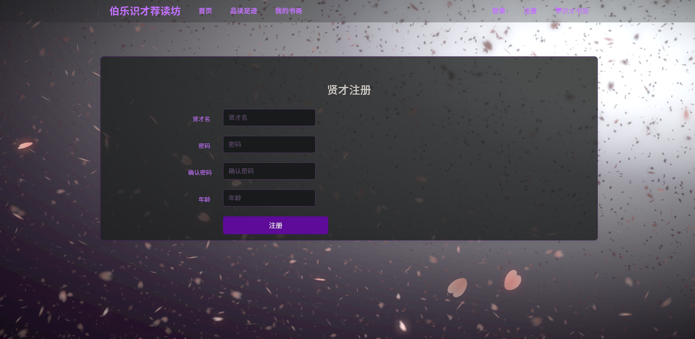
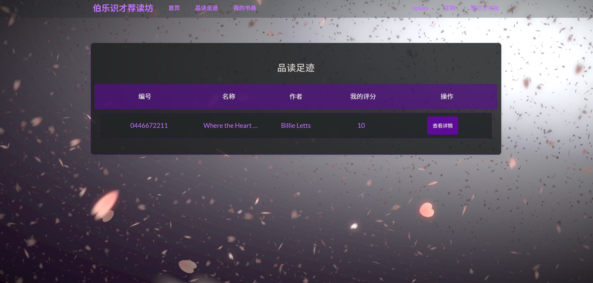
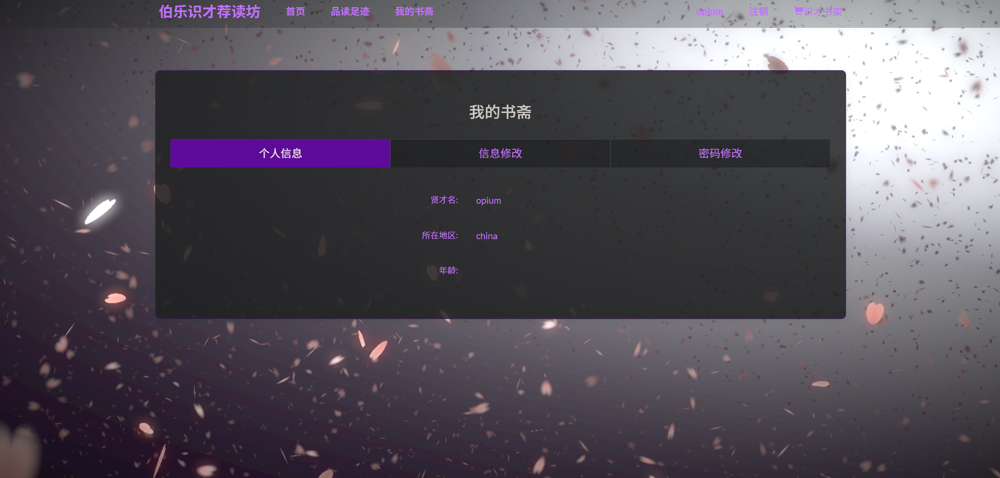
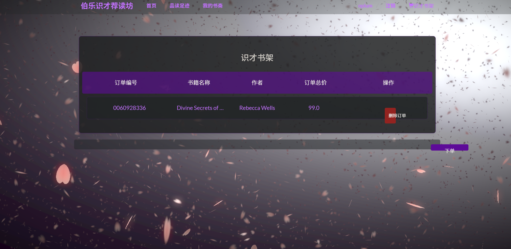
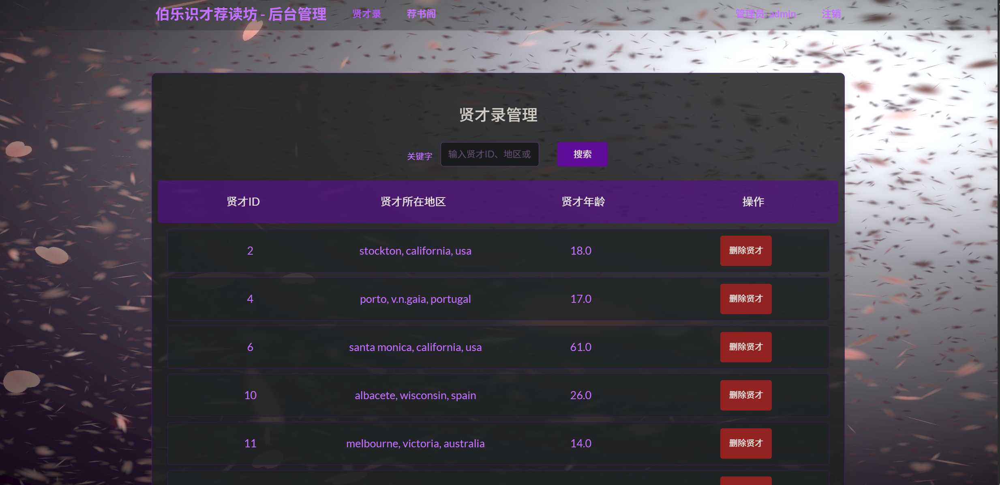
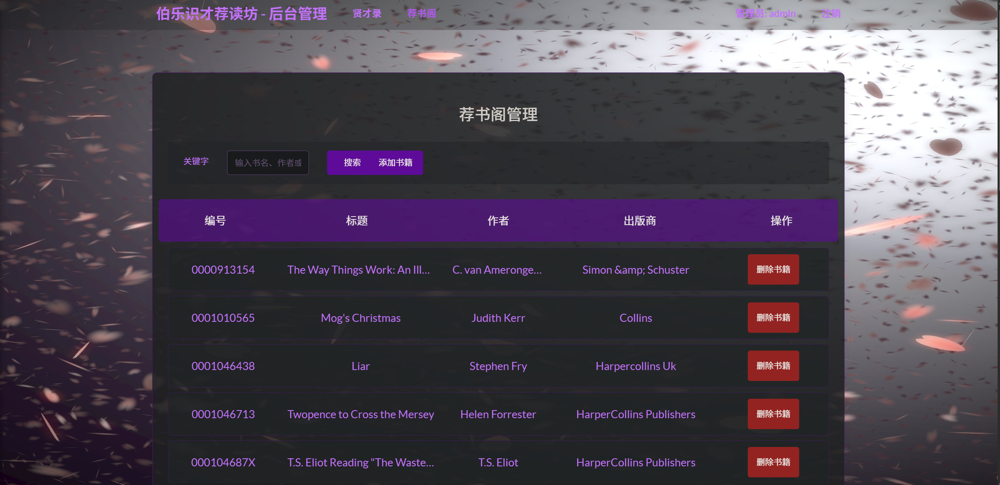

------------------------------------------------------------------------------------------------
# 伯乐识才荐读坊                          
------------------------------------------------------------------------------------------------

### 与原项目的区别

```
整个项目能直接现成使用
使用了更好看的前端
古风的设计主题
```

#### `主页`


#### `搜索功能`


#### `登录`


#### `注册`


#### `历史评分书单`


#### `书单`


#### `购物车`


#### `管理员 用户删除`


#### `管理员 书籍添加删除`



*  对图书数据使用tensorflow和GPU加速实现了初版的协同过滤算法
（为了tensorflow的tensor运算，所以会创建比较大的矩阵，会初始化2个约27W乘10W的矩阵）
作者训练环境配置：
```       
环境：ubuntu 
内存：64G
显卡：TaiTanXP * 4  （4*12G）
```
速度有比较大的提升。一天内可以训练完成。但是内存占用极高。接近42G内存。
所以在git上面CF4TensorFlow.py这个文件中第12行：    
```
Rating=Rating[:5000]   
```
设置了一个切片区间，默认使用5000，你可以按你的配置修改这个参数。
作者选择 Epoch 60000 Loss函数曲线 

### 功能清单

```
注册，登录，检索查询，评分，实时推荐，离线推荐，购物车，书单，删除购物车，删除书单。
管理员权限： 删除用户，添加书籍，删除书籍。
```

## 项目启动方式：

1、在config.yml与read_data_save_to_mysql.py中修改mysql配置信息
2、在code目录下使用python read_data_save_to_mysql.py导入数据
3、在code/web目录下使用python app.py使用系统

## 项目思路：

本项目实现了3个图书推荐功能：
+ 热门书籍 
    + 是将评分排名最高的几本书推荐给用户
+ 猜你喜欢
    + 通过数据库SQL语句实现
    + ”看了这本书的人也看了XX书“
    + 主要逻辑是：
        + 首先查该用户的浏览记录
        + 通过浏览过的书籍，找到也看过这本书的人
        + 在也看过这本书的人中，找评分较高的书推荐给用户
+ 推荐书籍
    + 离线计算好的推荐表的信息。使用到了协同过滤算法
    + 之后会做成按天更新
    + 目前的项目是实时推荐的，使用sql语句实现的
